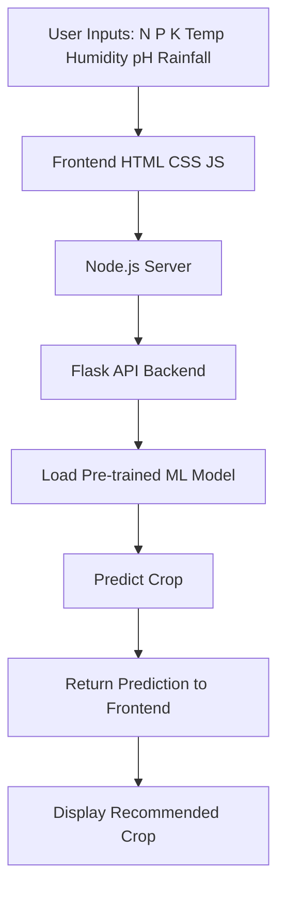

# 🌱 AI-Based Crop Recommendation System

> **Smart Farming • Data-Driven Decisions • Sustainable Agriculture**

[](https://github.com/yourusername/AI-Based-Crop-Recommendation)
[](https://aibasedcroprecommend.netlify.app)
[](https://www.python.org/)
[](https://flask.palletsprojects.com/)
[](https://nodejs.org/)
[](https://scikit-learn.org/)
[](https://opensource.org/licenses/MIT)

---

## 📌 Table of Contents

- [Problem Statement](#-problem-statement)
- [Our Solution](#-our-solution)
- [How It Works](#-how-it-works)
- [Key Features](#-key-features)
- [Tech Stack](#-tech-stack)
- [Project Structure](#-project-structure)
- [Live Demo](#-live-demo)
- [Installation & Setup](#-installation--setup)
- [Usage Guide](#-usage-guide)
- [Screenshots](#-screenshots)
- [Team](#-team)
- [Future Scope](#-future-scope)
- [Acknowledgments](#-acknowledgments)

---

## 🎯 Problem Statement

Agriculture is the backbone of many economies, yet farmers often struggle with **crop selection** due to:

- Unpredictable weather patterns
- Soil degradation and nutrient imbalances
- Lack of access to data-driven insights
- Traditional farming practices that may not optimize yield

Choosing the **wrong crop** for a given piece of land can lead to:

- Reduced yield and income
- Wastage of resources (water, fertilizers)
- Soil exhaustion and environmental harm

**Our goal:** Empower farmers with an **AI-powered tool** that recommends the most suitable crop based on soil nutrients and environmental conditions — enabling **precision agriculture** and **sustainable farming**.

---

## 💡 Our Solution

We built a **web-based Crop Recommendation System** that uses **Machine Learning** to analyze seven key parameters:

- Nitrogen (N), Phosphorus (P), Potassium (K) – soil nutrient levels  
- Temperature, Humidity, pH, Rainfall – environmental factors  

The model predicts the **best crop** from 22 different options, providing instant, actionable recommendations through a user-friendly interface.

### Why Our Solution Stands Out

| Feature | Benefit |
|---------|---------|
| **AI-Driven Accuracy** | Trained on real agricultural data for high precision |
| **Fast & Real-Time** | Flask API returns predictions in milliseconds |
| **Accessible** | Web-based, works on any device with a browser |
| **Easy to Use** | Simple input form, clear results |
| **Scalable** | Can be extended with additional data sources (weather APIs, satellite imagery) |
| **Open Source** | Free for anyone to use, modify, and improve |

---

## ⚙️ How It Works


1. User enters soil and climate data via the web form.
2. Frontend sends a POST request to the Flask API (hosted on the backend).
3. Flask receives the data, scales it, and passes it to the Random Forest classifier.
4. The model predicts the most suitable crop.
5. The result is sent back and displayed to the user.


### ✨ Key Features
- **🤖 AI-Powered Prediction** – Uses a Random Forest model with ~99% accuracy on test data.
- **🌾 Comprehensive Input** – Considers 7 critical parameters for holistic assessment.
- **📊 Data Visualization** – (Optional) Display charts of input vs. recommended crop.
- **⚡ Fast Response** – Predictions delivered in under 1 second.
- **🌍 Responsive Design** – Works seamlessly on desktop, tablet, and mobile.
- **🔗 RESTful API** – Easy integration with other applications.

## 🛠️ Tech Stack
| **Layer** | **Technology** |
|-----------|----------------|
| **Frontend** | HTML5, CSS3, JavaScript, Node.js |
| **Backend** | Python, Flask |
| **Machine Learning** | Scikit-Learn, Pandas, NumPy, Pickle |
| **Deployment** | Netlify (frontend), PythonAnywhere / Render (backend) |


## 📂 Project Structure

```
AI-BASED-CROP-RECOMMENDATION/
│
├── 📁 frontend/                    # Frontend application
│   ├── 📄 index.html               # Main HTML page
│   ├── 📄 style.css                # CSS styling
│   ├── 📄 script.js                # Client-side JavaScript (API calls, UI logic)
│   ├── 📄 server.js                # Node.js server for serving frontend
│   └── 📄 package.json             # NPM dependencies and scripts
│
├── 📁 backend/                     # Backend API and ML components
│   ├── 📄 app.py                   # Flask application (endpoints, routing)
│   ├── 📄 config.py                # Configuration settings (e.g., model paths)
│   ├── 📄 train_model.py           # Script to train and save the ML model
│   ├── 📄 requirements.txt         # Python package dependencies
│   │
│   ├── 📁 models/                  # Trained model artifacts
│   │   ├── 📄 crop_model.pkl       # Trained Random Forest classifier
│   │   ├── 📄 crop_labels.pkl      # Label encoder mapping crop names
│   │   └── 📄 scaler.pkl           # StandardScaler for feature normalization
│   │
│   ├── 📁 data/                    # Dataset
│   │   └── 📄 crop_data.csv        # Training data (N, P, K, temp, humidity, pH, rainfall, label)
│   │
│   └── 📁 utils/                   # Utility functions
│       └── 📄 helpers.py           # Helper functions (data preprocessing, etc.)
│
├── 📁 screenshots/                 # Screenshots for documentation
│   ├── home.png
│   └── result.png
│
├── 📄 README.md                    # Project documentation
└── 📄 LICENSE                      # MIT License
```

### 🌐 Live Demo
**🚀 Try it now**: https://aibasedcroprecommend.netlify.app

## 🚀 Installation & Setup
**Prerequisites**
- Python 3.8+
- Node.js 14+
- Git

## Quick Start (One-Line Commands)

```
# Clone the repository
git clone https://github.com/yourusername/AI-Based-Crop-Recommendation.git
cd AI-Based-Crop-Recommendation

# Set up and run backend
cd backend
python -m venv venv
source venv/bin/activate  # Windows: venv\Scripts\activate
pip install -r requirements.txt
python app.py &

# Set up and run frontend (in a new terminal)
cd ../frontend
npm install
npm start
```
## Detailed Steps

<details> <summary><b>Click for detailed installation guide</b></summary>

# 1.Clone the repository
- git clone https://github.com/yourusername/AI-Based-Crop-Recommendation.git
- cd AI-Based-Crop-Recommendation

# 2. Backend Setup
- cd backend
- python -m venv venv
- source venv/bin/activate  # Windows: venv\Scripts\activate
- pip install -r requirements.txt
- python app.py

# 3. Frontend Setup (new terminal)
- cd frontend
- npm install
- npm start

# 4. Access the application
- Frontend: http://localhost:3000
- Backend API: http://localhost:5000 (for testing)

</details>

## 📖 Usage Guide

1.Open the application in your browser.
2.Enter the following parameters:
- Nitrogen (N) – e.g., 90
- Phosphorus (P) – e.g., 40
- Potassium (K) – e.g., 30
- Temperature (°C) – e.g., 25
- Humidity (%) – e.g., 70
- pH – e.g., 6.5
- Rainfall (mm) – e.g., 200
3. Click the "Predict Crop" button.
4. View the recommended crop and additional information (if any).
5. Repeat for different conditions.
💡 Tip: Use real field data for the most accurate recommendations.

# 📷 Screenshots

# Home Page
https://screenshots/home.png

# Prediction Result
https://screenshots/result.png

### 👥 Team
**Name**	           **Role**
Aakash Yadav	       Full-Stack Developer & ML Engineer
Soumya Tripathy        Data Science and Data Analytics

### 🔮 Future Scope
- **🧪 Fertilizer Recommendation** – Suggest optimal fertilizers and quantities.
- **🦠 Disease Prediction** – Detect crop diseases from leaf images (deep learning).
- **📈 Yield Estimation** – Predict expected yield for recommended crop.
- **📱 Mobile App** – Native Android/iOS app for offline use.
- **🗺️ GIS Integration** – Map-based crop suitability analysis.
- **🌐 Multilingual Support** – Reach farmers in their native languages.
- **📊 Farmer Dashboard** – Track historical predictions and outcomes.

## 🙏 Acknowledgments

- Dataset: Crop Recommendation Dataset (Kaggle)
- Inspiration: Sustainable Development Goals (SDG 2 – Zero Hunger)
- Built with ❤️ for the Hackathon community.


## 📄 License

This project is licensed under the MIT License – see the [LICENSE](LICENSE) file for details.

## ⭐ Support Us
If this project helps you, please give it a ⭐ on GitHub and share it with fellow farmers and developers!

<p align="center"> <a href="https://github.com/aakashyadav-dev/AI-Based-Crop-Recommendation">  </a> <a href="https://github.com/aakashyadav-dev/AI-Based-Crop-Recommendation/network/members">  </a> </p>

<p align="center"> <i>“Empowering farmers with AI – one prediction at a time.”</i> </p> 


  
